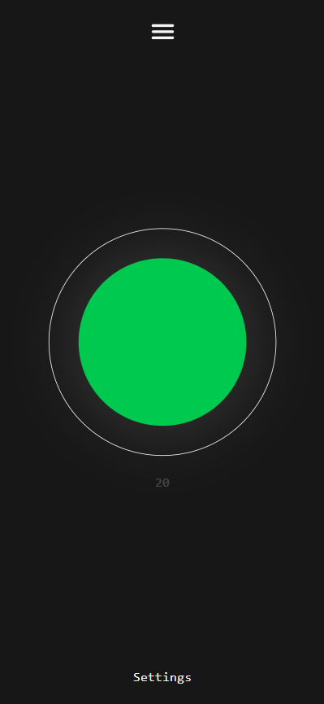
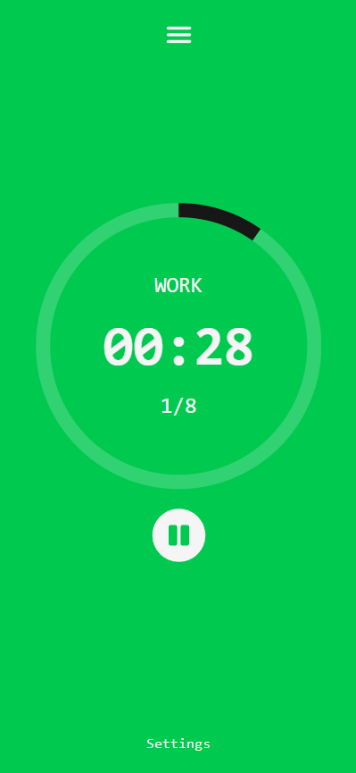
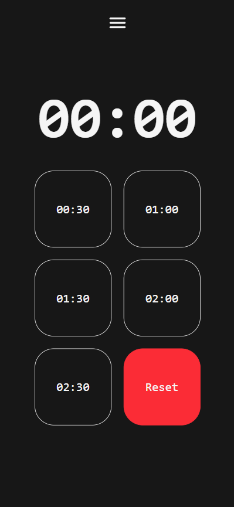
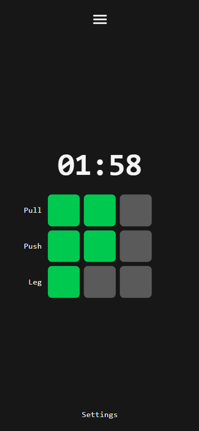

# Health-Toolkit

[Health-Toolkit](https://www.toolkit.health/) is a collection of tools related to physical and mental health.

<div align="center">

| 🫁 Breath | 🔥 HIIT | ⏰ Timer | 💪 Train |
|:---:|:---:|:---:|:---:|
|  |  |  |  |

</div>

## 🚀 Getting Started

### Prerequisites
- Node.js (version 18 or higher)
- npm or yarn package manager

### Installation

1. Clone the repository:
```bash
git clone https://github.com/hoffy98/Health-Toolkit.git
cd Health-Toolkit
```

2. Install dependencies:
```bash
npm install
```

3. Start the development server:
```bash
npm run dev
```

4. Open your browser and navigate to `http://localhost:5173` (or the port shown in your terminal)

### Building for Production

```bash
npm run build
```

This will create a `dist` folder with the production-ready files.

## 🛠️ Tech Stack

- **Frontend Framework**: React 19
- **Build Tool**: Vite
- **Styling**: Tailwind CSS 4.1
- **Animations**: Framer Motion
- **Routing**: React Router DOM
- **Icons**: React Icons
- **Language**: TypeScript
- **Linting**: ESLint

## 📁 Project Structure

```
Health-Toolkit/
├── src/
│   ├── components/          # Reusable UI components
│   │   ├── Modal.tsx
│   │   ├── NumberInput.tsx
│   │   └── RangeSlider.tsx
│   ├── pages/              # Main application pages
│   │   ├── Breath.tsx      # Breathing exercises
│   │   ├── HIIT.tsx        # HIIT workouts
│   │   ├── Home.tsx        # Landing page
│   │   ├── Timer.tsx       # Timer functionality
│   │   └── Train.tsx       # Training routines
│   ├── App.tsx             # Main app component
│   ├── Layout.tsx          # App layout wrapper
│   └── main.tsx            # Application entry point
├── img/                    # Application screenshots
├── public/                 # Static assets
└── ...config files
```

## 📝 License

This project is licensed under the MIT License - see the [LICENSE](LICENSE) file for details.
 
